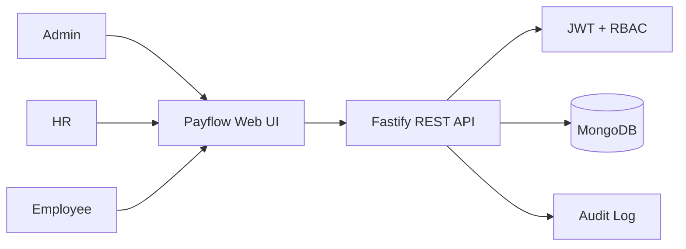
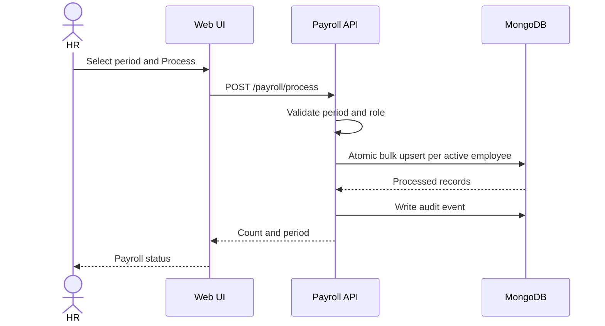
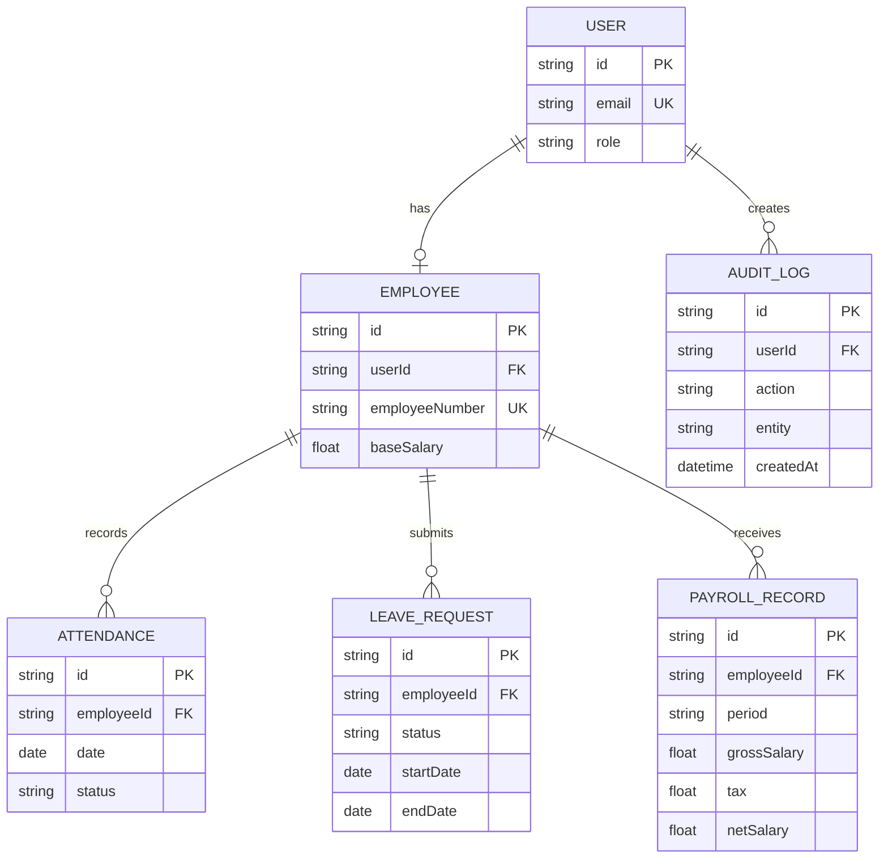
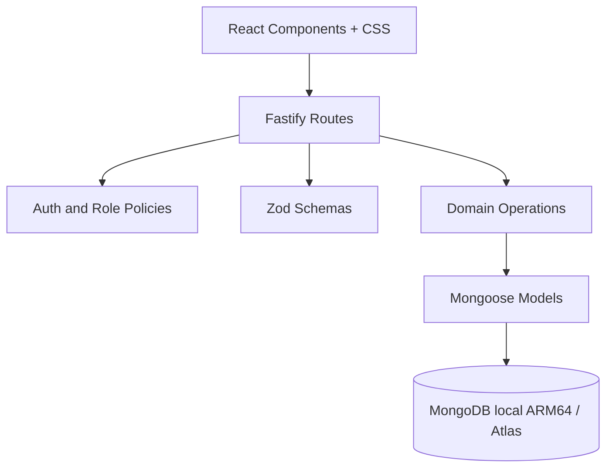

# UML and ER diagrams

These diagrams use Mermaid and render in GitHub, VS Code, and most documentation portals.

## System context

```mermaid
flowchart LR
  Admin --> Web[Payflow Web UI]
  HR --> Web
  Employee --> Web
  Web --> API[Fastify REST API]
  API --> Auth[JWT + RBAC]
  API --> DB[(MongoDB)]
  API --> Audit[Audit Log]
```

## Main sequence: payroll

```mermaid
sequenceDiagram
  actor HR
  participant UI as Web UI
  participant API as Payroll API
  participant DB as MongoDB
  HR->>UI: Select period and Process
  UI->>API: POST /payroll/process
  API->>API: Validate period and role
  API->>DB: Atomic bulk upsert per active employee
  DB-->>API: Processed records
  API->>DB: Write audit event
  API-->>UI: Count and period
  UI-->>HR: Payroll status
```

## ER diagram

```mermaid
erDiagram
  USER ||--o| EMPLOYEE : has
  EMPLOYEE ||--o{ ATTENDANCE : records
  EMPLOYEE ||--o{ LEAVE_REQUEST : submits
  EMPLOYEE ||--o{ PAYROLL_RECORD : receives
  USER ||--o{ AUDIT_LOG : creates
  USER { string id PK string email UK string role }
  EMPLOYEE { string id PK string userId FK string employeeNumber UK float baseSalary }
  ATTENDANCE { string id PK string employeeId FK date date string status }
  LEAVE_REQUEST { string id PK string employeeId FK string status date startDate date endDate }
  PAYROLL_RECORD { string id PK string employeeId FK string period float grossSalary float tax float netSalary }
  AUDIT_LOG { string id PK string userId FK string action string entity datetime createdAt }
```

## Component view

```mermaid
flowchart TB
  UI[React Components + CSS] --> Routes[Fastify Routes]
  Routes --> Policies[Auth and Role Policies]
  Routes --> Validation[Zod Schemas]
  Routes --> Services[Domain Operations]
  Services --> Mongoose[Mongoose Models]
  Mongoose --> Mongo[(MongoDB local ARM64 / Atlas)]
```
